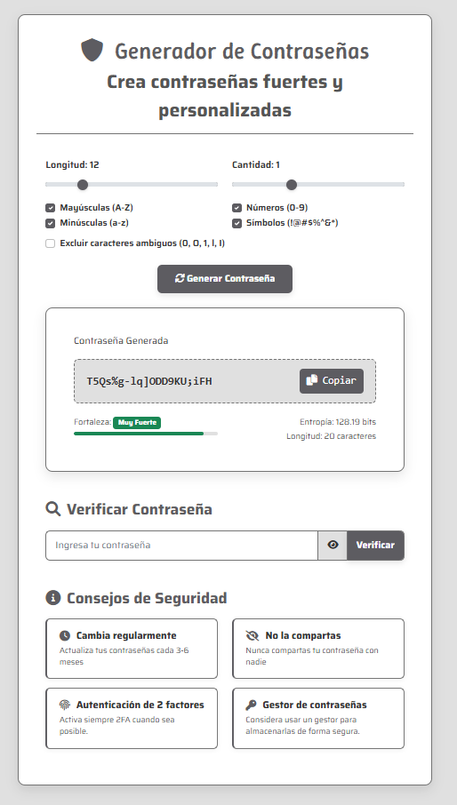

# Generador de Contraseñas Seguras



Este es un proyecto web moderno y responsivo desarrollado con Flask para el backend, y Bootstrap, HTML, CSS (personalizado) y JavaScript para el frontend. Permite a los usuarios generar contraseñas seguras y verificar la fortaleza de sus propias contraseñas, ofreciendo una interfaz intuitiva y consejos de seguridad.

---

## 🚀 Características

- **Generador de Contraseñas Personalizable**: Longitud ajustable, tipos de caracteres (mayúsculas, minúsculas, números, símbolos), exclusión de caracteres ambiguos y generación de múltiples contraseñas.
- **Verificador de Fortaleza de Contraseña**: Análisis de fortaleza (Débil, Moderada, Fuerte, Muy Fuerte), cálculo de entropía, detección de contraseñas comunes y sugerencias de mejora.
- **Interfaz de Usuario Amigable**: Diseño responsivo con Bootstrap, estilos personalizados y uso de Font Awesome y Google Fonts.
- **Backend con Flask**: Servidor ligero para la lógica de generación y verificación.

---

## ⚙️ Tecnologías Utilizadas

- **Backend**: Python, Flask  
- **Frontend**: HTML5, CSS3 (custom), JavaScript (ES6+), Bootstrap 5.1.3, Font Awesome 6.0.0, Google Fonts

---

## 📦 Configuración y Ejecución

Para una configuración detallada y pasos de ejecución, **consulta el archivo `app.py`**. Contiene toda la información necesaria para poner en marcha la aplicación.

### Pasos rápidos:

1. Asegúrate de tener Python instalado.
2. Crea la estructura de carpetas: `templates/index.html`, `static/style.css`, `static/main.js`.
3. Instala Flask:  
   ```bash
   pip install Flask
